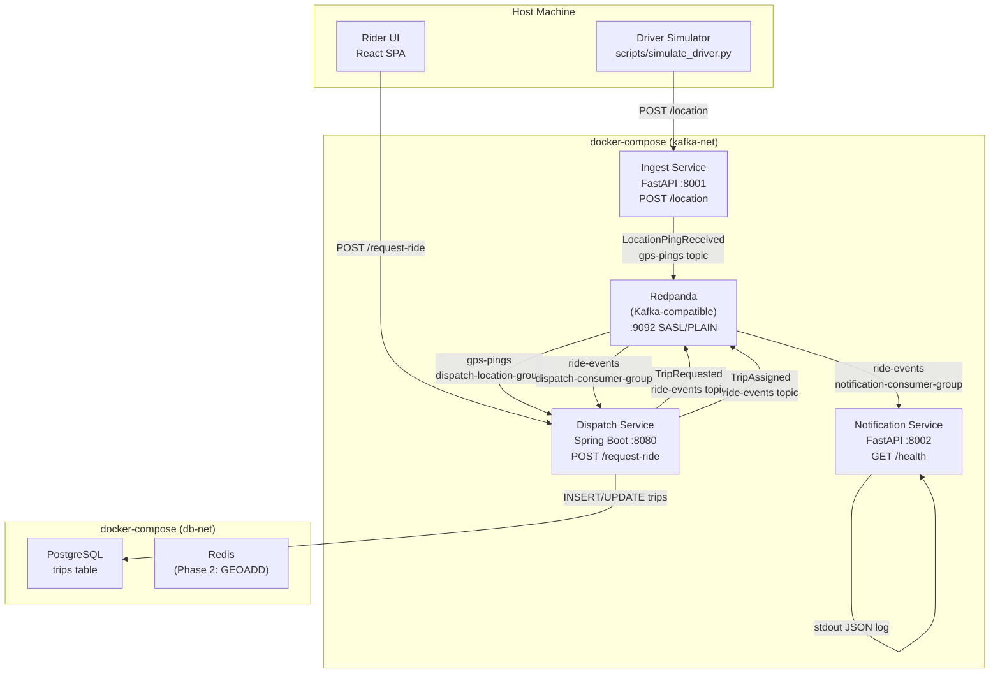

# Design Document: e2e-skeleton

## Overview

The e2e-skeleton establishes the foundational end-to-end data flow for the Real-Time Ride/Delivery Tracking & Dispatch Platform. The goal is to prove that a single driver GPS ping can travel the full pipeline — from HTTP ingestion through Kafka, through dispatch logic, to a logged notification — all running locally in docker-compose.

The pipeline is:

```
Driver GPS Ping → POST /location (Ingest Service)
  → LocationPingReceived event → gps-pings topic (Redpanda)
    → [Dispatch Service consumes gps-pings — stub, logs only]
    → [Tracking Service — deferred to Phase 2]

Rider Request → POST /request-ride (Dispatch Service)
  → TripRequested event → ride-events topic
    → [Dispatch Service self-consumes TripRequested]
      → hardcoded nearest-driver selection
      → Trip persisted to PostgreSQL (status: REQUESTED → ASSIGNED)
      → TripAssigned event → ride-events topic
        → Notification Service consumes TripAssigned
          → structured JSON log to stdout
```

This skeleton deliberately avoids Kubernetes, Flink, real push notification providers, and production-grade matching. It validates the core architecture — bounded contexts, Kafka domain events, service isolation, security baseline — before complexity is added.

### Key Design Decisions

- **Choreography-based saga (Phase 1)**: The 3-step saga (`TripRequested → TripAssigned → NotificationDispatched`) is simple enough for implicit choreography. No saga orchestrator is needed yet (see ADR 006).
- **CQRS local read model stub**: The Dispatch Service consumes `gps-pings` via a dedicated consumer group (`dispatch-location-group`) but does not yet write to Redis. This stubs the CQRS projection established in ADR 005 so Phase 2 can add the `GEOADD` logic without architectural change.
- **Eventual consistency accepted**: The dual-write problem in `POST /request-ride` (Kafka publish + HTTP 202) is accepted in Phase 1. The Trip record is written to PostgreSQL before the HTTP response is returned, so the `trip_id` is always backed by a DB record. The Outbox Pattern is deferred to Phase 2 (see ADR 002).
- **Idempotent producers, deferred consumer dedup**: All Kafka producers use `enable.idempotence=true`. Consumer-side deduplication via a `processed_events` table is deferred to Phase 2 (see ADR 003).

---

## Architecture

### Component Topology



### Network Segmentation

```
kafka-net:    redpanda, ingest-service, dispatch-service, notification-service
db-net:       postgres, redis, dispatch-service
frontend-net: dispatch-service, rider-ui
```

The Ingest Service and Notification Service have no access to `db-net`. The Rider UI has no access to `kafka-net` or `db-net`.

### Kafka Topics

| Topic | Producers | Consumers | Purpose |
|---|---|---|---|
| `gps-pings` | ingest-service | dispatch-service (`dispatch-location-group`), tracking-service (Phase 2) | Driver location events |
| `ride-events` | dispatch-service | dispatch-service (`dispatch-consumer-group`), notification-service (`notification-consumer-group`) | Trip lifecycle events |
| `dispatch-commands` | (Phase 2) | (Phase 2) | Reserved |
| `notifications` | notification-service (Phase 2) | — | Reserved |

---

## Components and Interfaces

### Ingest Service (`services/ingest/`)

**Runtime**: Python 3.11, FastAPI, `confluent-kafka` Python client

**HTTP Interface**:

```
POST /location
  Request body (JSON, max 64 KB):
    driver_id:  string, non-empty, max 128 chars
    latitude:   float, -90.0 to 90.0
    longitude:  float, -180.0 to 180.0
    timestamp:  string, ISO 8601

  Responses:
    202 { "message_id": "<uuid>" }   — successful Kafka publish; message_id == event_id
    413                              — request body exceeds 64 KB
    422 { "detail": [...] }          — missing/invalid fields
    503                              — Kafka topic unavailable

GET /health
  Response: 200 { "status": "ok" }
```

**Kafka Producer**:
- Topic: `gps-pings`
- Message key: `driver_id` (ensures ordering per driver)
- `enable.idempotence=true`
- On publish failure: return HTTP 503, log warning, do not silently drop

**Domain Event published**:
```json
{
  "event_id": "<uuid>",
  "event_type": "LocationPingReceived",
  "occurred_at": "<ISO 8601>",
  "payload": {
    "driver_id": "<string>",
    "latitude": <float>,
    "longitude": <float>,
    "timestamp": "<ISO 8601>"
  }
}
```

**OpenAPI**: Auto-generated at startup, written to `services/ingest/openapi.json`.

**Dockerfile**: `python:3.11.9-slim`, non-root user `appuser`.

**Environment variables**:
```
KAFKA_BOOTSTRAP_SERVERS
KAFKA_TOPIC_GPS_PINGS
KAFKA_SASL_USERNAME
KAFKA_SASL_PASSWORD
SERVICE_PORT
```

---

### Dispatch Service (`services/dispatch/`)

**Runtime**: Java 21, Spring Boot 3.x, Spring Kafka, Spring Data JPA, springdoc-openapi

**HTTP Interface**:

```
POST /request-ride
  Request body (JSON, max 64 KB):
    rider_id:         string, non-empty, max 128 chars
    pickup_location:  { latitude: float, longitude: float }

  Responses:
    202 { "trip_id": "<uuid>" }   — TripRequested event published, Trip persisted
    413                           — request body exceeds 64 KB
    422 { ... }                   — missing/invalid fields

GET /health
  Response: 200 { "status": "UP" }

GET /v3/api-docs
  Response: 200 OpenAPI 3.x JSON spec
```

**Kafka Consumers**:

1. **`ride-events` consumer** (group: `dispatch-consumer-group`)
   - Filters for `event_type == "TripRequested"`
   - Selects driver from static in-memory list (hardcoded Phase 1 matching)
   - Updates Trip status to `ASSIGNED` in PostgreSQL
   - Publishes `TripAssigned` event to `ride-events`
   - Must complete within 2 seconds of consumption

2. **`gps-pings` consumer** (group: `dispatch-location-group`)
   - Validates envelope: `event_type == "LocationPingReceived"`, `event_id` is non-empty UUID
   - Logs receipt at DEBUG level
   - Does NOT write to Redis in Phase 1 (CQRS read model stub per ADR 005)
   - On deserialization failure or envelope validation failure: log WARNING, continue

**Kafka Producer**:
- Topics: `ride-events`
- `enable.idempotence=true`
- Exponential backoff retry on startup (up to 5 attempts before non-zero exit)

**Domain Events published**:

`TripRequested`:
```json
{
  "event_id": "<uuid>",
  "event_type": "TripRequested",
  "occurred_at": "<ISO 8601>",
  "payload": {
    "trip_id": "<uuid>",
    "rider_id": "<string>",
    "pickup_location": { "latitude": <float>, "longitude": <float> },
    "requested_at": "<ISO 8601>"
  }
}
```

`TripAssigned`:
```json
{
  "event_id": "<uuid>",
  "event_type": "TripAssigned",
  "occurred_at": "<ISO 8601>",
  "payload": {
    "trip_id": "<uuid>",
    "driver_id": "<string>",
    "rider_id": "<string>",
    "assigned_at": "<ISO 8601>"
  }
}
```

`TripCancelled` (modelled in code, not triggered in Phase 1):
```json
{
  "event_id": "<uuid>",
  "event_type": "TripCancelled",
  "occurred_at": "<ISO 8601>",
  "payload": {
    "trip_id": "<uuid>",
    "reason": "<string>",
    "cancelled_at": "<ISO 8601>"
  }
}
```

**OpenAPI**: Exported from `/v3/api-docs`, committed to `services/dispatch/openapi.json`.

**Dockerfile**: `eclipse-temurin:21-jre-jammy`, non-root user `appuser`.

**Environment variables**:
```
KAFKA_BOOTSTRAP_SERVERS
KAFKA_TOPIC_RIDE_EVENTS
KAFKA_TOPIC_GPS_PINGS
KAFKA_SASL_USERNAME
KAFKA_SASL_PASSWORD
KAFKA_CONSUMER_GROUP_RIDE_EVENTS
KAFKA_CONSUMER_GROUP_GPS_PINGS
SPRING_DATASOURCE_URL
SPRING_DATASOURCE_USERNAME
SPRING_DATASOURCE_PASSWORD
SERVICE_PORT
```

---

### Notification Service (`services/notification/`)

**Runtime**: Python 3.11, FastAPI, `confluent-kafka` Python client

**HTTP Interface**:

```
GET /health
  Response: 200 { "status": "ok" }
```

**Kafka Consumer** (group: `notification-consumer-group`):
- Topic: `ride-events`
- Filters for `event_type == "TripAssigned"` — all other event types are acknowledged and skipped
- On `TripAssigned`: logs structured JSON to stdout
- On non-JSON message: logs WARNING with raw bytes, continues
- Duplicate `TripAssigned` deliveries: logged again (idempotent log writes acceptable in Phase 1)

**Stdout log format** (one JSON line per notification):
```json
{
  "event_id": "<uuid>",
  "event_type": "TripAssigned",
  "trip_id": "<uuid>",
  "driver_id": "<string>",
  "rider_id": "<string>",
  "assigned_at": "<ISO 8601>",
  "notification_sent_at": "<ISO 8601>"
}
```

**OpenAPI**: Auto-generated at startup, written to `services/notification/openapi.json`.

**Dockerfile**: `python:3.11.9-slim`, non-root user `appuser`.

**Environment variables**:
```
KAFKA_BOOTSTRAP_SERVERS
KAFKA_TOPIC_RIDE_EVENTS
KAFKA_SASL_USERNAME
KAFKA_SASL_PASSWORD
KAFKA_CONSUMER_GROUP_ID
SERVICE_PORT
```

---

### Driver Simulator (`scripts/simulate_driver.py`)

**Runtime**: Python 3.11 (no additional dependencies beyond `requests` and standard library)

**CLI Interface**:
```
python simulate_driver.py \
  --driver-id <string> \
  --route-file <path to GeoJSON LineString> \
  --rate <pings/sec, default 10> \
  --ingest-url <base URL>
```

**Behavior**:
- Reads GeoJSON LineString from `--route-file`
- Interpolates positions along the route at the configured rate
- POSTs each position to `{ingest-url}/location`
- On non-2xx response: logs error to stderr (status code + body), continues
- On route end: loops back to start (infinite loop until interrupted)

**Sample route**: `scripts/sample_route.geojson` — GeoJSON LineString with ≥10 coordinate pairs.

---

### Rider UI (`services/rider-ui/` or `services/gateway/`)

**Runtime**: React 18, Leaflet (via `react-leaflet`)

**Features**:
- Leaflet map centred on a default coordinate (configurable)
- "Request Ride" button: POSTs to `REACT_APP_DISPATCH_URL/request-ride` with hardcoded `rider_id` and map centre as `pickup_location`
- On HTTP 202: displays `trip_id` on screen
- On non-2xx: displays human-readable error message (no blank/crashed page)

**Build**: Static build served from within the Compose environment. `REACT_APP_DISPATCH_URL` is a build-time environment variable.

---

## Data Models

### PostgreSQL Schema (Dispatch Service)

```sql
-- trips table: Trip aggregate state machine
CREATE TABLE trips (
    trip_id         UUID PRIMARY KEY,
    rider_id        VARCHAR(128) NOT NULL,
    driver_id       VARCHAR(128),                    -- NULL until ASSIGNED
    status          VARCHAR(20) NOT NULL,             -- REQUESTED | ASSIGNED | CANCELLED
    pickup_lat      DOUBLE PRECISION NOT NULL,
    pickup_lng      DOUBLE PRECISION NOT NULL,
    requested_at    TIMESTAMPTZ NOT NULL,
    assigned_at     TIMESTAMPTZ,                     -- NULL until ASSIGNED
    updated_at      TIMESTAMPTZ NOT NULL DEFAULT now()
);

-- Index for status-based queries (Phase 2 Saga State Monitor)
CREATE INDEX idx_trips_status ON trips(status);
CREATE INDEX idx_trips_updated_at ON trips(updated_at);
```

**Status transitions (Phase 1)**:
```
REQUESTED → ASSIGNED   (on TripAssigned event published)
REQUESTED → CANCELLED  (not triggered in Phase 1; state exists in model)
```

### Kafka Domain Event Envelope

All Domain Events share this envelope structure (defined in `shared/`):

```json
{
  "event_id":    "string (UUID, non-empty)",
  "event_type":  "string (e.g. LocationPingReceived, TripRequested, TripAssigned)",
  "occurred_at": "string (ISO 8601 timestamp)",
  "payload":     "object (event-specific data)"
}
```

The `event_id` is generated by the producer at publish time. It is immutable and serves as the deduplication key for Phase 2 consumer-side idempotency.

### Redis Key Namespace (Phase 1 — reserved, not written)

The following key namespace is reserved for the Dispatch Service's CQRS local read model (Phase 2):

```
dispatch:drivers   — ZSET (geospatial), keyed by driver_id
```

The Tracking Service's authoritative namespace (`location:drivers:{driver_id}`) is separate and not accessed by the Dispatch Service.

---

## Correctness Properties

*A property is a characteristic or behavior that should hold true across all valid executions of a system — essentially, a formal statement about what the system should do. Properties serve as the bridge between human-readable specifications and machine-verifiable correctness guarantees.*

The e2e-skeleton is a suitable candidate for property-based testing in the following areas: HTTP input validation (coordinate ranges, field presence, body size limits, string length limits), Kafka event envelope correctness, event filtering logic, and the trip_id correlation invariant across the pipeline. Infrastructure checks (docker-compose topology, Dockerfile configuration, file existence) are not suitable for PBT and are covered by smoke and integration tests.

**Property Reflection**: After reviewing all testable criteria, the following consolidations apply:
- Properties 2.4 (missing fields → 422) and 2.5 (out-of-range coordinates → 422) are distinct validation axes and are kept separate.
- Properties 2.10 and 3.11 (64 KB body size limit) are the same invariant applied to two different services; they are stated as a single combined property (Property 5).
- Properties 3.14 and 3.15 (envelope validation and malformed message handling) are combined into a single property (Property 6) since they both describe the same validation pipeline.
- Properties 4.2 and 4.3 (TripAssigned logging and event filtering) are kept separate as they test distinct behaviors.
- Property 10.9 (driver_id/rider_id length validation) is combined with 2.4 into Property 2 since they are both input validation properties on the same endpoint.

---

### Property 1: GPS ping event envelope round-trip

*For any* valid GPS ping (any non-empty `driver_id` up to 128 chars, any latitude in [−90, 90], any longitude in [−180, 180], any ISO 8601 timestamp), when the Ingest Service publishes a `LocationPingReceived` event, the `message_id` returned in the HTTP 202 response SHALL equal the `event_id` in the Kafka message, and the Kafka message SHALL contain `event_type = "LocationPingReceived"` with a `payload` that preserves the original `driver_id`, `latitude`, `longitude`, and `timestamp` values.

**Validates: Requirements 2.2, 2.6**

---

### Property 2: Ingest Service rejects invalid GPS ping inputs

*For any* request to `POST /location` where at least one of the following is true — a required field (`driver_id`, `latitude`, `longitude`, `timestamp`) is absent, `latitude` is outside [−90, 90], `longitude` is outside [−180, 180], `driver_id` is empty, or `driver_id` exceeds 128 characters — the Ingest Service SHALL return HTTP 422 and SHALL NOT publish any event to Kafka.

**Validates: Requirements 2.4, 2.5, 10.9**

---

### Property 3: TripAssigned event envelope correctness

*For any* valid `TripRequested` event consumed by the Dispatch Service (any `trip_id` UUID, any `rider_id` up to 128 chars, any valid `pickup_location`), the resulting `TripAssigned` event published to `ride-events` SHALL contain: a non-empty `event_id` UUID, `event_type = "TripAssigned"`, a valid ISO 8601 `occurred_at`, and a `payload` with the same `trip_id`, a non-empty `driver_id` from the static driver list, the same `rider_id`, and a valid ISO 8601 `assigned_at`.

**Validates: Requirements 3.3**

---

### Property 4: Dispatch Service event type filtering

*For any* message published to the `ride-events` topic with an `event_type` other than `"TripRequested"`, the Dispatch Service's `ride-events` consumer SHALL NOT trigger driver assignment logic and SHALL NOT publish a `TripAssigned` event.

**Validates: Requirements 3.1**

---

### Property 5: HTTP request body size enforcement

*For any* HTTP request body sent to `POST /location` (Ingest Service) or `POST /request-ride` (Dispatch Service) whose byte size exceeds 64 KB, the service SHALL return HTTP 413 and SHALL NOT process the request. For any request body at or below 64 KB that is otherwise valid, the service SHALL process it normally.

**Validates: Requirements 2.10, 3.11, 10.8**

---

### Property 6: Dispatch Service gps-pings envelope validation

*For any* message consumed from the `gps-pings` topic by the Dispatch Service, if the message cannot be deserialized as JSON, or if the deserialized object does not have `event_type = "LocationPingReceived"` or has an empty/missing `event_id`, the service SHALL log a warning and continue consuming subsequent messages without crashing. Valid envelopes SHALL be logged at DEBUG level.

**Validates: Requirements 3.14, 3.15**

---

### Property 7: Notification Service logs all required fields for TripAssigned events

*For any* valid `TripAssigned` event consumed by the Notification Service (any `event_id`, `trip_id`, `driver_id`, `rider_id`, `assigned_at`), the structured JSON log line written to stdout SHALL contain all of: `event_id`, `event_type`, `trip_id`, `driver_id`, `rider_id`, `assigned_at`, and `notification_sent_at`.

**Validates: Requirements 4.2**

---

### Property 8: Notification Service filters non-TripAssigned events

*For any* message consumed from `ride-events` with `event_type` other than `"TripAssigned"`, the Notification Service SHALL acknowledge the message and skip it without logging an error or writing to stdout.

**Validates: Requirements 4.3**

---

### Property 9: Trip state machine persistence round-trip

*For any* valid ride request (any `rider_id`, any valid `pickup_location`), after `POST /request-ride` returns HTTP 202 with a `trip_id`, the `trips` table in PostgreSQL SHALL contain a record with that `trip_id` and `status = 'REQUESTED'`. After the Dispatch Service publishes the corresponding `TripAssigned` event, the same record SHALL be updated to `status = 'ASSIGNED'` with a non-null `driver_id` and `assigned_at`.

**Validates: Requirements 3.16**

---

### Property 10: trip_id correlation across the full pipeline

*For any* valid ride request submitted via `POST /request-ride`, the `trip_id` returned in the HTTP 202 response SHALL equal the `trip_id` in the `TripAssigned` Domain Event logged by the Notification Service for that same request.

**Validates: Requirements 11.2**

---

### Property 11: Driver Simulator route looping

*For any* valid GeoJSON LineString route of any length (≥2 coordinate pairs), after the Driver Simulator emits a ping for the last coordinate in the route, the next emitted ping SHALL have coordinates near the first coordinate of the route (within interpolation tolerance).

**Validates: Requirements 5.6**

---

### Property 12: Dispatch Service startup fails fast on missing environment variables

*For any* required environment variable (`KAFKA_BOOTSTRAP_SERVERS`, `SPRING_DATASOURCE_URL`, `SPRING_DATASOURCE_USERNAME`, `SPRING_DATASOURCE_PASSWORD`, `KAFKA_SASL_USERNAME`, `KAFKA_SASL_PASSWORD`), starting the Dispatch Service without that variable SHALL result in a descriptive error log identifying the missing variable and a non-zero exit code.

**Validates: Requirements 10.10**

---

## Error Handling

### Ingest Service

| Scenario | Behavior |
|---|---|
| Kafka broker unavailable | Return HTTP 503; log warning with broker address; do not silently drop |
| Missing required field | Return HTTP 422 with structured error body identifying missing fields |
| Invalid coordinate range | Return HTTP 422 |
| Request body > 64 KB | Return HTTP 413 |
| `driver_id` empty or > 128 chars | Return HTTP 422 |
| Kafka publish succeeds | Return HTTP 202 with `message_id` = `event_id` |

### Dispatch Service

| Scenario | Behavior |
|---|---|
| Kafka broker unreachable at startup | Log error, retry with exponential backoff (up to 5 attempts), exit non-zero |
| Missing required env var at startup | Log descriptive error identifying the variable, exit non-zero |
| `TripRequested` consumed but DB write fails | Log error; do not publish `TripAssigned`; message remains uncommitted for redelivery |
| `gps-pings` message not valid JSON | Log WARNING to stderr, commit offset, continue |
| `gps-pings` envelope validation failure | Log WARNING to stderr, commit offset, continue |
| Request body > 64 KB | Return HTTP 413 |
| `rider_id` empty or > 128 chars | Return HTTP 422 |
| Dispatch must complete within 2s | If exceeded, log WARNING; message is still committed |

### Notification Service

| Scenario | Behavior |
|---|---|
| Consumed message is not valid JSON | Log WARNING to stderr with raw bytes, commit offset, continue |
| `event_type` is not `TripAssigned` | Acknowledge and skip, no log output |
| Missing required env var at startup | Log descriptive error, exit non-zero |
| Duplicate `TripAssigned` delivery | Log again (idempotent log writes acceptable in Phase 1) |

### Driver Simulator

| Scenario | Behavior |
|---|---|
| Ingest Service returns non-2xx | Log error to stderr (status code + body), continue emitting |
| Route file not found or invalid GeoJSON | Log error to stderr, exit non-zero |
| Network timeout | Log error to stderr, continue emitting |

### Smoke Test Script (`scripts/smoke_test.sh`)

| Scenario | Behavior |
|---|---|
| Expected log line found within 10s | Exit 0 |
| Expected log line not found within 10s | Exit non-zero, print diagnostic identifying which pipeline stage did not produce output |

---

## Testing Strategy

### Dual Testing Approach

Unit tests cover specific examples, edge cases, and error conditions. Property-based tests verify universal properties across many generated inputs. Both are necessary for comprehensive coverage.

### Property-Based Testing

**Library selection**:
- Python services (Ingest, Notification): [Hypothesis](https://hypothesis.readthedocs.io/) — the standard PBT library for Python
- Java service (Dispatch): [jqwik](https://jqwik.net/) — property-based testing for JUnit 5

**Configuration**: Each property test runs a minimum of 100 iterations. Kafka interactions are mocked (using `unittest.mock` / Mockito) to keep tests fast and deterministic.

**Tag format**: Each property test is tagged with a comment referencing the design property:
```
# Feature: e2e-skeleton, Property 1: GPS ping event envelope round-trip
```

**Property test mapping**:

| Property | Service | Library | What is generated |
|---|---|---|---|
| 1: GPS ping envelope round-trip | Ingest | Hypothesis | Random driver_id (1–128 chars), lat/lng in valid range, ISO 8601 timestamps |
| 2: Invalid GPS ping inputs rejected | Ingest | Hypothesis | Missing fields, out-of-range coordinates, empty/oversized driver_id |
| 3: TripAssigned envelope correctness | Dispatch | jqwik | Random trip_id UUIDs, rider_id strings, pickup coordinates |
| 4: Dispatch event type filtering | Dispatch | jqwik | Random event_type strings (excluding "TripRequested") |
| 5: 64 KB body size enforcement | Ingest + Dispatch | Hypothesis + jqwik | Payloads of varying byte sizes around the 64 KB boundary |
| 6: gps-pings envelope validation | Dispatch | jqwik | Valid envelopes, missing event_id, wrong event_type, non-JSON bytes |
| 7: Notification logs required fields | Notification | Hypothesis | Random TripAssigned payloads with varying field values |
| 8: Notification filters non-TripAssigned | Notification | Hypothesis | Random event_type strings (excluding "TripAssigned") |
| 9: Trip state machine persistence | Dispatch | jqwik | Random rider_id, pickup coordinates; verifies DB state transitions |
| 10: trip_id correlation | Integration | Hypothesis | Random ride requests; verifies end-to-end trip_id invariant |
| 11: Driver Simulator route looping | Simulator | Hypothesis | GeoJSON routes of varying lengths (2–100 coordinate pairs) |
| 12: Startup fails fast on missing env vars | All services | Hypothesis + jqwik | Each required env var omitted in turn |

### Unit Tests

Unit tests focus on:
- Specific examples demonstrating correct behavior (e.g., a well-formed GPS ping returns 202)
- Integration points between components (e.g., Kafka producer called with correct arguments)
- Error conditions not covered by property generators (e.g., Kafka broker unavailable → HTTP 503)
- Concrete endpoint behavior (e.g., `GET /health` returns `{"status": "ok"}`)

Avoid writing unit tests that duplicate what property tests already cover (e.g., do not write 10 unit tests for coordinate validation when Property 2 covers the full input space).

### Integration Tests

Integration tests run against the full docker-compose environment:

1. **End-to-end pipeline** (Requirement 11.1): Driver Simulator emits ping → Ride Request submitted → `TripAssigned` log appears in Notification Service within 5 seconds.
2. **Sustained throughput** (Requirement 11.3): Ingest Service accepts 10 GPS pings/second for 5 seconds without HTTP 5xx.
3. **Compose health** (Requirement 7.2): All services reach healthy state within 120 seconds of `docker-compose up`.

### Smoke Tests

The `scripts/smoke_test.sh` script covers the full end-to-end validation:
1. Start Driver Simulator for 5 seconds
2. Submit one Ride Request via `POST /request-ride`
3. Poll Notification Service container logs for a matching `TripAssigned` log line
4. Assert match found within 10 seconds; exit non-zero with diagnostic if not

Dockerfile and directory structure checks are validated as part of the CI pipeline (not runtime tests).

### Test File Locations

```
services/ingest/tests/
  test_location_endpoint.py       — unit + property tests (Hypothesis)
  test_kafka_producer.py          — unit tests with mocked Kafka

services/dispatch/src/test/java/
  LocationPingConsumerTest.java   — property tests (jqwik)
  TripAssignedProducerTest.java   — property tests (jqwik)
  RequestRideEndpointTest.java    — unit tests
  TripRepositoryTest.java         — unit tests (H2 in-memory)

services/notification/tests/
  test_notification_consumer.py  — unit + property tests (Hypothesis)

scripts/
  smoke_test.sh                  — end-to-end smoke test
  simulate_driver.py             — driver simulator (also tested by Property 11)
```
