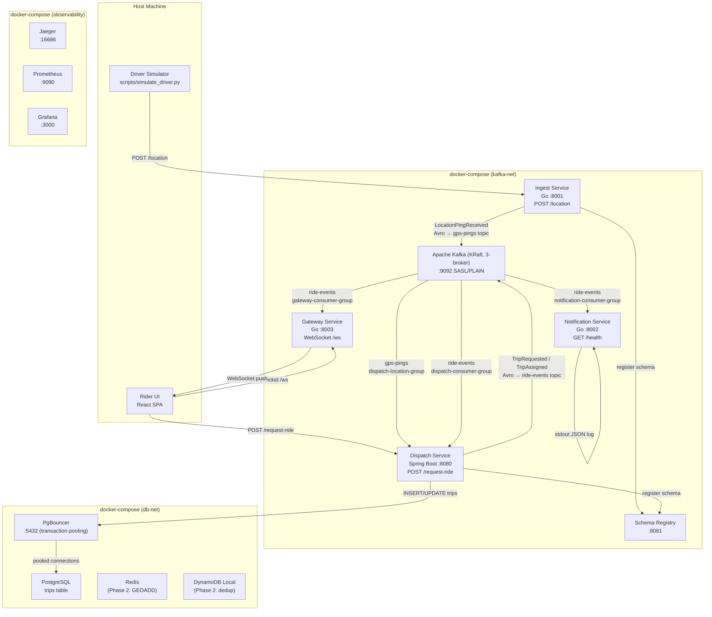

# Design Document: e2e-skeleton

## Overview

The e2e-skeleton establishes the foundational end-to-end data flow for the Real-Time Ride/Delivery Tracking & Dispatch Platform. The goal is to prove that a single driver GPS ping can travel the full pipeline — from HTTP ingestion through Kafka, through dispatch logic, to a logged notification — all running locally in docker-compose.

The pipeline is:

```
Driver GPS Ping → POST /location (Ingest Service)
  → LocationPingReceived Avro event → gps-pings topic (Kafka KRaft, 3-broker)
    → [Dispatch Service consumes gps-pings — stub, logs only]
    → [Tracking Service — deferred to Phase 2]

Rider Request → POST /request-ride (Dispatch Service)
  → TripRequested Avro event → ride-events topic
    → [Dispatch Service self-consumes TripRequested]
      → hardcoded nearest-driver selection
      → Trip persisted to PostgreSQL via PgBouncer (status: REQUESTED → ASSIGNED)
      → TripAssigned Avro event → ride-events topic
        → Notification Service consumes TripAssigned
          → structured JSON log to stdout
```

This skeleton deliberately avoids Kubernetes, Flink, real push notification providers, and production-grade matching. It validates the core architecture — bounded contexts, Kafka domain events, service isolation, security baseline — before complexity is added.

### Key Design Decisions

- **Choreography-based saga (Phase 1)**: The 3-step saga (`TripRequested → TripAssigned → NotificationDispatched`) is simple enough for implicit choreography. No saga orchestrator is needed yet (see ADR 006).
- **CQRS local read model stub**: The Dispatch Service consumes `gps-pings` via a dedicated consumer group (`dispatch-location-group`) but does not yet write to Redis. This stubs the CQRS projection established in ADR 005 so Phase 2 can add the `GEOADD` logic without architectural change.
- **Eventual consistency accepted**: The dual-write problem in `POST /request-ride` (Kafka publish + HTTP 202) is accepted in Phase 1. The Trip record is written to PostgreSQL (via PgBouncer) before the HTTP response is returned, so the `trip_id` is always backed by a DB record. The Outbox Pattern is deferred to Phase 2 (see ADR 002).
- **Idempotent producers, deferred consumer dedup**: All Kafka producers use `acks=all` and `enable.idempotence=true`. Consumer-side deduplication via a DynamoDB `processed_events` table is deferred to Phase 2 (see ADR 003).
- **Avro serialisation from Phase 1**: All Domain Events are serialised as Avro using Confluent Schema Registry. Schemas live in `shared/avro/`. The broker rejects messages that violate the registered schema — malformed events never reach consumers.
- **Gateway as Kafka consumer**: The Gateway Service is a Kafka consumer (`gateway-consumer-group`) — Kafka fans out events to it. Its sole job is protocol translation: Kafka Domain Event → WebSocket frame pushed to the connected rider. It does not fan out events.

---

## Architecture

### Component Topology



### Network Segmentation

```
kafka-net:    kafka-1, kafka-2, kafka-3, schema-registry, ingest-service, dispatch-service, notification-service, gateway-service
db-net:       postgres, pgbouncer, redis, dynamodb-local, dispatch-service
frontend-net: dispatch-service, gateway-service, rider-ui
observability-net: jaeger, prometheus, grafana, ingest-service, dispatch-service, notification-service, gateway-service
```

The Ingest Service and Notification Service have no access to `db-net`. The Rider UI has no access to `kafka-net` or `db-net`.

### Observability

All services instrument with OpenTelemetry from Phase 1. Production systems are not observable by accident — OTel is wired in from the first service, not retrofitted.

- **Traces**: `trace_id` and `span_id` are propagated through Kafka message headers. Every hop (HTTP → Kafka produce → Kafka consume → DB write) is a span in the same trace. A single GPS ping is traceable end-to-end across all services.
- **Metrics**: Every service exposes a Prometheus-format `/metrics` endpoint — Kafka consumer lag, HTTP p50/p95/p99 latency, DB query duration, WebSocket connection count.
- **Logs**: Structured JSON with a `trace_id` field on every log line — logs correlate to traces in Jaeger/Grafana.
- **Local dev**: Jaeger (`:16686`) for traces, Prometheus (`:9090`) + Grafana (`:3000`) for metrics, all in docker-compose.
- **Production**: AWS X-Ray (traces) + Amazon Managed Prometheus + Grafana.

**OTel SDK per language**:
- Go services: `go.opentelemetry.io/otel` + `go.opentelemetry.io/contrib/instrumentation/net/http/otelhttp`
- Java (Dispatch): `io.opentelemetry:opentelemetry-spring-boot-starter`

**Kafka trace propagation**: Producers inject `traceparent` / `tracestate` W3C headers into Kafka message headers. Consumers extract these headers and create child spans, maintaining the distributed trace across the async boundary.

### Kafka Topics

All topics use `replication.factor=3`, `min.insync.replicas=2`. All messages are Avro-serialised via Confluent Schema Registry. Producers use `acks=all`, `enable.idempotence=true`.

| Topic | Producers | Consumers | Purpose |
|---|---|---|---|
| `gps-pings` | ingest-service | dispatch-service (`dispatch-location-group`), tracking-service (Phase 2) | Driver location Avro events |
| `ride-events` | dispatch-service | dispatch-service (`dispatch-consumer-group`), notification-service (`notification-consumer-group`), gateway-service (`gateway-consumer-group`) | Trip lifecycle Avro events |
| `dispatch-commands` | (Phase 2) | (Phase 2) | Reserved |
| `notifications` | notification-service (Phase 2) | — | Reserved |

---

## Components and Interfaces

### Ingest Service (`services/ingest/`)

**Runtime**: Go 1.22, `net/http` (or `chi` router), `confluentinc/confluent-kafka-go` Kafka client, `go-playground/validator` for input validation

**HTTP Interface**:

```
POST /location
  Request body (JSON, max 64 KB):
    driver_id:  string, non-empty, max 128 chars
    latitude:   float, -90.0 to 90.0
    longitude:  float, -180.0 to 180.0
    timestamp:  string, ISO 8601

  Responses:
    202 { "message_id": "<uuid>" }   — successful Kafka publish; message_id == event_id
    413                              — request body exceeds 64 KB
    422 { "detail": [...] }          — missing/invalid fields
    503                              — Kafka topic unavailable

GET /health
  Response: 200 { "status": "ok" }

GET /metrics
  Response: 200 Prometheus text format
```

**Kafka Producer**:
- Topic: `gps-pings`
- Message key: `driver_id` (ensures ordering per driver)
- Serialisation: Avro via Confluent Schema Registry (`SCHEMA_REGISTRY_URL`)
- Schema registered on first publish from `shared/avro/location_ping_received.avsc`
- `acks=all`, `enable.idempotence=true`
- On publish failure: return HTTP 503, log warning, do not silently drop

**Domain Event published** (Avro schema — `shared/avro/location_ping_received.avsc`):
```json
{
  "event_id": "<uuid>",
  "event_type": "LocationPingReceived",
  "occurred_at": "<ISO 8601>",
  "payload": {
    "driver_id": "<string>",
    "latitude": "<float>",
    "longitude": "<float>",
    "timestamp": "<ISO 8601>"
  }
}
```

**OpenAPI**: Auto-generated at startup, written to `services/ingest/openapi.json`.

**Dockerfile**: Multi-stage — `golang:1.22-alpine` build stage → `gcr.io/distroless/static-debian12` final stage. Non-root user. No shell in final image.

**Environment variables**:
```
KAFKA_BOOTSTRAP_SERVERS
KAFKA_TOPIC_GPS_PINGS
KAFKA_SASL_USERNAME
KAFKA_SASL_PASSWORD
SCHEMA_REGISTRY_URL
SERVICE_PORT
OTEL_EXPORTER_OTLP_ENDPOINT
```

---

### Dispatch Service (`services/dispatch/`)

**Runtime**: Java 21, Spring Boot 3.x, Spring Kafka, Spring Data JPA, springdoc-openapi

**HTTP Interface**:

```
POST /request-ride
  Request body (JSON, max 64 KB):
    rider_id:         string, non-empty, max 128 chars
    pickup_location:  { latitude: float, longitude: float }

  Responses:
    202 { "trip_id": "<uuid>" }   — TripRequested event published, Trip persisted
    413                           — request body exceeds 64 KB
    422 { ... }                   — missing/invalid fields

GET /health
  Response: 200 { "status": "UP" }

GET /v3/api-docs
  Response: 200 OpenAPI 3.x JSON spec
```

**Kafka Consumers**:

1. **`ride-events` consumer** (group: `dispatch-consumer-group`)
   - Filters for `event_type == "TripRequested"`
   - Deserialises Avro message via Schema Registry
   - Selects driver from static in-memory list (hardcoded Phase 1 matching)
   - Updates Trip status to `ASSIGNED` in PostgreSQL (via PgBouncer)
   - Publishes `TripAssigned` Avro event to `ride-events`
   - Must complete within 2 seconds of consumption

2. **`gps-pings` consumer** (group: `dispatch-location-group`)
   - Validates envelope: `event_type == "LocationPingReceived"`, `event_id` is non-empty UUID
   - Logs receipt at DEBUG level
   - Does NOT write to Redis in Phase 1 (CQRS read model stub per ADR 005)
   - On deserialization failure or envelope validation failure: log WARNING, continue

**Kafka Producer**:
- Topics: `ride-events`
- Serialisation: Avro via Confluent Schema Registry (`SCHEMA_REGISTRY_URL`)
- `acks=all`, `enable.idempotence=true`
- Exponential backoff retry on startup (up to 5 attempts before non-zero exit)

**Domain Events published**:

`TripRequested` (Avro schema — `shared/avro/trip_requested.avsc`):
```json
{
  "event_id": "<uuid>",
  "event_type": "TripRequested",
  "occurred_at": "<ISO 8601>",
  "payload": {
    "trip_id": "<uuid>",
    "rider_id": "<string>",
    "pickup_location": { "latitude": "<float>", "longitude": "<float>" },
    "requested_at": "<ISO 8601>"
  }
}
```

`TripAssigned` (Avro schema — `shared/avro/trip_assigned.avsc`):
```json
{
  "event_id": "<uuid>",
  "event_type": "TripAssigned",
  "occurred_at": "<ISO 8601>",
  "payload": {
    "trip_id": "<uuid>",
    "driver_id": "<string>",
    "rider_id": "<string>",
    "assigned_at": "<ISO 8601>"
  }
}
```

`TripCancelled` (Avro schema — `shared/avro/trip_cancelled.avsc`, modelled in code, not triggered in Phase 1):
```json
{
  "event_id": "<uuid>",
  "event_type": "TripCancelled",
  "occurred_at": "<ISO 8601>",
  "payload": {
    "trip_id": "<uuid>",
    "reason": "<string>",
    "cancelled_at": "<ISO 8601>"
  }
}
```

**OpenAPI**: Exported from `/v3/api-docs`, committed to `services/dispatch/openapi.json`.

**Dockerfile**: `eclipse-temurin:21-jre-jammy`, non-root user `appuser`.

**Environment variables**:
```
KAFKA_BOOTSTRAP_SERVERS
KAFKA_TOPIC_RIDE_EVENTS
KAFKA_TOPIC_GPS_PINGS
KAFKA_SASL_USERNAME
KAFKA_SASL_PASSWORD
KAFKA_CONSUMER_GROUP_RIDE_EVENTS
KAFKA_CONSUMER_GROUP_GPS_PINGS
SCHEMA_REGISTRY_URL
SPRING_DATASOURCE_URL          (points to PgBouncer, not PostgreSQL directly)
SPRING_DATASOURCE_USERNAME
SPRING_DATASOURCE_PASSWORD
SERVICE_PORT
OTEL_EXPORTER_OTLP_ENDPOINT
```

---

### Notification Service (`services/notification/`)

**Runtime**: Go 1.22, `confluentinc/confluent-kafka-go` Kafka consumer

**HTTP Interface**:

```
GET /health
  Response: 200 { "status": "ok" }

GET /metrics
  Response: 200 Prometheus text format
```

**Kafka Consumer** (group: `notification-consumer-group`):
- Topic: `ride-events`
- Deserialises Avro messages via Confluent Schema Registry (`SCHEMA_REGISTRY_URL`)
- Filters for `event_type == "TripAssigned"` — all other event types are acknowledged and skipped
- On `TripAssigned`: logs structured JSON to stdout
- On Avro deserialisation failure: logs WARNING with raw bytes, continues
- Duplicate `TripAssigned` deliveries: logged again (idempotent log writes acceptable in Phase 1)
- Phase 2: DynamoDB `processed_events` table provides atomic dedup via `ConditionExpression: attribute_not_exists(event_id)`

**Stdout log format** (one JSON line per notification):
```json
{
  "event_id": "<uuid>",
  "event_type": "TripAssigned",
  "trip_id": "<uuid>",
  "driver_id": "<string>",
  "rider_id": "<string>",
  "assigned_at": "<ISO 8601>",
  "notification_sent_at": "<ISO 8601>",
  "trace_id": "<string>"
}
```

**OpenAPI**: Auto-generated at startup, written to `services/notification/openapi.json`.

**Dockerfile**: Multi-stage — `golang:1.22-alpine` build stage → `gcr.io/distroless/static-debian12` final stage. Non-root user. No shell in final image.

**Environment variables**:
```
KAFKA_BOOTSTRAP_SERVERS
KAFKA_TOPIC_RIDE_EVENTS
KAFKA_SASL_USERNAME
KAFKA_SASL_PASSWORD
KAFKA_CONSUMER_GROUP_ID
SCHEMA_REGISTRY_URL
SERVICE_PORT
OTEL_EXPORTER_OTLP_ENDPOINT
```

---

### Gateway Service (`services/gateway/`)

**Runtime**: Go 1.22, `gorilla/websocket` or `nhooyr.io/websocket`, `confluentinc/confluent-kafka-go` Kafka consumer

**HTTP / WebSocket Interface**:

```
GET /ws?rider_id=<string>
  Upgrades to WebSocket connection.
  Server pushes Domain Event payloads as JSON frames to the connected rider.

GET /health
  Response: 200 { "status": "ok" }

GET /metrics
  Response: 200 Prometheus text format
```

**Role**: The Gateway Service is a **Kafka consumer** (`gateway-consumer-group`) — Kafka fans out events to it. Its sole job is **protocol translation**: Kafka Domain Event → WebSocket frame pushed to the connected rider. It does NOT fan out events; Kafka does that via consumer groups.

**Kafka Consumer** (group: `gateway-consumer-group`):
- Topics: `ride-events` (filters `TripAssigned`, `TripCancelled`, `TripCompleted`) and `ETAUpdated`
- Deserialises Avro messages via Confluent Schema Registry
- On each consumed event: looks up `rider_id` in session registry → pushes JSON frame over WebSocket

**Session Registry**:
- Phase 1: in-memory `map[rider_id → *websocket.Conn]` (single instance)
- Phase 2: Redis Pub/Sub (`HSET gateway:sessions:{rider_id} instance_id connection_id`) for multi-instance fan-out

**Owns**:
- WebSocket connection lifecycle (accept, heartbeat, graceful disconnect)
- Session registry (`rider_id → WebSocket connection`)
- No domain logic, no DB writes — pure infrastructure / protocol bridge

**Dockerfile**: Multi-stage — `golang:1.22-alpine` build stage → `gcr.io/distroless/static-debian12` final stage. Non-root user.

**Environment variables**:
```
KAFKA_BOOTSTRAP_SERVERS
KAFKA_TOPIC_RIDE_EVENTS
KAFKA_SASL_USERNAME
KAFKA_SASL_PASSWORD
KAFKA_CONSUMER_GROUP_ID
SCHEMA_REGISTRY_URL
SERVICE_PORT
OTEL_EXPORTER_OTLP_ENDPOINT
```

---

### Driver Simulator (`scripts/simulate_driver.py`)

**Runtime**: Python 3.11 (no additional dependencies beyond `requests` and standard library)

**CLI Interface**:
```
python simulate_driver.py \
  --driver-id <string> \
  --route-file <path to GeoJSON LineString> \
  --rate <pings/sec, default 10> \
  --ingest-url <base URL>
```

**Behavior**:
- Reads GeoJSON LineString from `--route-file`
- Interpolates positions along the route at the configured rate
- POSTs each position to `{ingest-url}/location`
- On non-2xx response: logs error to stderr (status code + body), continues
- On route end: loops back to start (infinite loop until interrupted)

**Sample route**: `scripts/sample_route.geojson` — GeoJSON LineString with ≥10 coordinate pairs.

---

### Rider UI (`services/rider-ui/` or `services/gateway/`)

**Runtime**: React 18, Leaflet (via `react-leaflet`)

**Features**:
- Leaflet map centred on a default coordinate (configurable)
- "Request Ride" button: POSTs to `REACT_APP_DISPATCH_URL/request-ride` with hardcoded `rider_id` and map centre as `pickup_location`
- On HTTP 202: displays `trip_id` on screen
- On non-2xx: displays human-readable error message (no blank/crashed page)

**Build**: Static build served from within the Compose environment. `REACT_APP_DISPATCH_URL` is a build-time environment variable.

---

## Low-Level Design

This section specifies the internal module structure, design patterns, and key function/method signatures for each service. It bridges the component interfaces defined above and the implementation tasks that follow.

---

### 1. Ingest Service (`services/ingest/`)

#### Module Structure

```
services/ingest/
  main.go                    — HTTP server setup (chi router), middleware chain, graceful shutdown
  config/config.go           — Config struct, fail-fast env var loading via os.Getenv; exits non-zero on missing var
  handler/location.go        — POST /location handler; LocationHandler struct with Producer field
  handler/health.go          — GET /health handler
  kafka/producer.go          — Producer struct; Avro serialisation via Schema Registry client; Publish() returns (string, error)
  model/gps_ping.go          — GpsPingRequest struct with go-playground/validator tags
  events/location_ping.go    — BuildLocationPingEvent() factory function; generates event_id (UUID4) and occurred_at
  middleware/body_size.go    — MaxBodySize(limit int64) middleware func(http.Handler) http.Handler
  tests/                     — Go test files using testing + testify + pgregory.net/rapid (PBT)
```

#### Design Patterns Applied

- **Dependency Injection**: `LocationHandler` is a struct with a `Producer` field set at construction time in `main.go`. The handler method is a method on the struct — the producer is never instantiated inside the handler body. No framework magic; plain Go constructor injection.
- **Factory Function**: `BuildLocationPingEvent(ping GpsPingRequest) DomainEvent` constructs the full Avro event envelope. UUID generation (`event_id`) and timestamp generation (`occurred_at`) are isolated inside this function, making it a pure, deterministic-input function that is straightforward to test with `rapid`.
- **Config struct (12-Factor)**: `config.Config` is populated by `LoadConfig()` which calls `os.Getenv` for each required variable. If any required variable is absent, `LoadConfig()` logs a descriptive error identifying the missing variable and calls `os.Exit(1)` — the server never starts with a missing configuration.
- **Middleware for body size**: `MaxBodySize(limit int64) func(http.Handler) http.Handler` is a standard Go middleware applied in the `chi` router chain in `main.go`. The 64 KB limit is enforced before the request body reaches any handler — it is not checked inline in the handler.
- **Error return for Kafka publish**: `Producer.Publish()` returns `(string, error)`. The handler checks the error and returns HTTP 503 on failure. This keeps the happy path clean and avoids silent error swallowing.

#### Key Function Signatures

```go
// config/config.go
package config

type Config struct {
    KafkaBootstrapServers string
    KafkaTopic            string
    KafkaSASLUsername     string
    KafkaSASLPassword     string
    SchemaRegistryURL     string
    ServicePort           string
    OTELEndpoint          string
}

// LoadConfig reads all required env vars via os.Getenv.
// Logs a descriptive error and calls os.Exit(1) if any required var is absent.
func LoadConfig() Config { ... }

// events/location_ping.go
package events

type DomainEvent struct {
    EventID    string                 // UUID4, generated at publish time
    EventType  string
    OccurredAt string                 // ISO 8601
    Payload    map[string]interface{}
}

// BuildLocationPingEvent constructs the full Avro event envelope.
// Generates EventID (UUID4) and OccurredAt (time.Now().UTC() ISO 8601).
// Copies driver_id, latitude, longitude, timestamp from ping into Payload.
// Never returns an error — all inputs are pre-validated.
func BuildLocationPingEvent(ping model.GpsPingRequest) DomainEvent { ... }

// kafka/producer.go
package kafka

type Producer struct {
    producer          *confluent.Producer
    schemaRegistryURL string
    topic             string
}

func NewProducer(cfg config.Config) (*Producer, error) { ... }

// Publish serialises event as Avro via Schema Registry, calls producer.Produce(), flushes.
// Returns event_id on success. Returns error on delivery failure — caller returns HTTP 503.
func (p *Producer) Publish(key string, event events.DomainEvent) (string, error) { ... }

// handler/location.go
package handler

type LocationHandler struct {
    Producer *kafka.Producer
}

// ServeHTTP handles POST /location.
// Decodes and validates GpsPingRequest, calls BuildLocationPingEvent, calls Producer.Publish.
// Returns 202 { "message_id": event_id } on success; 503 on Kafka error.
func (h *LocationHandler) ServeHTTP(w http.ResponseWriter, r *http.Request) { ... }

// middleware/body_size.go
package middleware

// MaxBodySize returns a middleware that limits request body to limit bytes.
// Returns HTTP 413 if the body exceeds the limit before the handler is called.
func MaxBodySize(limit int64) func(http.Handler) http.Handler { ... }
```

#### Sequence: POST /location (happy path)

```
Client → POST /location (JSON body)
  → MaxBodySize middleware: body ≤ 64 KB? → pass; else 413
  → LocationHandler.ServeHTTP()
      → json.Decode → GpsPingRequest; validate struct tags → 422 if invalid
      → BuildLocationPingEvent(ping) → DomainEvent
      → Producer.Publish(key=driver_id, event)
          → Avro serialise via Schema Registry
          → confluent-kafka Produce() + Flush()
      → return 202 { "message_id": event.EventID }
      → on error: return 503
```

---

### 2. Dispatch Service (`services/dispatch/`)

#### Package Structure

```
com.dispatch/
  DispatchApplication.java                  — @SpringBootApplication, startup validation
  config/
    AppConfig.java                          — @Configuration, KafkaTemplate bean, env var validation
    KafkaConsumerConfig.java                — Consumer factory beans for ride-events and gps-pings
  domain/
    Trip.java                               — @Entity, fields: tripId, riderId, driverId, status,
                                              pickupLat, pickupLng, requestedAt, assignedAt, updatedAt
    TripStatus.java                         — enum: REQUESTED, ASSIGNED, CANCELLED;
                                              assertCanTransitionTo() guard method
    TripRepository.java                     — JpaRepository<Trip, UUID>
  events/
    DomainEventEnvelope.java                — record: eventId, eventType, occurredAt, payload (Map<String,Object>)
    TripRequestedPayload.java               — record: tripId, riderId, pickupLocation, requestedAt
    TripAssignedPayload.java                — record: tripId, driverId, riderId, assignedAt
    TripCancelledPayload.java               — record: tripId, reason, cancelledAt (Phase 1: modelled only)
    EventEnvelopeFactory.java               — static factory: buildTripRequested(), buildTripAssigned()
  service/
    DispatchService.java                    — @Service, orchestrates: persist → publish → return tripId
    DriverRegistry.java                     — @Component, static in-memory driver list, selectDriver()
    DriverSelectionStrategy.java            — interface: selectDriver(PickupLocation) -> String
    HardcodedDriverSelectionStrategy.java   — implements DriverSelectionStrategy, round-robin from list
  consumer/
    RideEventsConsumer.java                 — @KafkaListener, ride-events topic, dispatch-consumer-group
    LocationPingConsumer.java               — @KafkaListener, gps-pings topic, dispatch-location-group
    EnvelopeValidator.java                  — stateless validator: validate(DomainEventEnvelope) -> void
  web/
    RideController.java                     — @RestController, POST /request-ride
    HealthController.java                   — GET /health
    dto/
      RequestRideRequest.java               — record with @Valid annotations
      RequestRideResponse.java              — record: tripId (UUID)
      PickupLocation.java                   — record: latitude (double), longitude (double)
```

#### Design Patterns Applied

- **State Machine with guard**: `TripStatus.assertCanTransitionTo(TripStatus next)` throws `IllegalStateTransitionException` if the requested transition is not valid for the current state. The guard is enforced in the domain enum — not scattered across service methods — so invalid transitions are impossible to reach without an explicit exception.
- **Factory pattern for events**: `EventEnvelopeFactory` is a stateless utility class with static factory methods. All UUID generation (`eventId`) and timestamp generation (`occurredAt`) are isolated here. `DispatchService` never calls `UUID.randomUUID()` directly.
- **Strategy pattern (stub)**: `DriverSelectionStrategy` interface is defined in Phase 1 with `HardcodedDriverSelectionStrategy` as the sole implementation. `DispatchService` depends on the interface, not the concrete class. Phase 2 can inject a geospatial Redis-backed strategy without modifying `DispatchService`.
- **Template Method via Spring Kafka**: `@KafkaListener` methods in `RideEventsConsumer` and `LocationPingConsumer` delegate immediately to private handler methods. Envelope validation is extracted to `EnvelopeValidator.validate(DomainEventEnvelope)` — a separate, independently testable component.
- **Fail-fast configuration**: `AppConfig` has a `@PostConstruct` method `validateRequiredEnvVars()` that iterates a list of required environment variable names and throws `IllegalStateException` (with the missing variable name) if any are absent. This runs before the application context finishes starting.

#### Key Method Signatures

```java
// domain/TripStatus.java
public enum TripStatus {
    REQUESTED, ASSIGNED, CANCELLED;

    private static final Map<TripStatus, Set<TripStatus>> VALID_TRANSITIONS = Map.of(
        REQUESTED, Set.of(ASSIGNED, CANCELLED),
        ASSIGNED,  Set.of(CANCELLED),
        CANCELLED, Set.of()
    );

    public void assertCanTransitionTo(TripStatus next) {
        if (!VALID_TRANSITIONS.get(this).contains(next)) {
            throw new IllegalStateTransitionException(this, next);
        }
    }
}

// service/DriverSelectionStrategy.java
public interface DriverSelectionStrategy {
    String selectDriver(PickupLocation pickup);
}

// service/HardcodedDriverSelectionStrategy.java
@Component
public class HardcodedDriverSelectionStrategy implements DriverSelectionStrategy {
    private static final List<String> DRIVERS = List.of("driver-001", "driver-002", "driver-003");
    private final AtomicInteger counter = new AtomicInteger(0);

    @Override
    public String selectDriver(PickupLocation pickup) {
        // Round-robin selection from static list; ignores pickup in Phase 1
        return DRIVERS.get(counter.getAndIncrement() % DRIVERS.size());
    }
}

// service/DispatchService.java
@Service
public class DispatchService {
    @Transactional
    public UUID requestRide(String riderId, PickupLocation pickup) {
        // 1. Generate tripId (UUID)
        // 2. Persist Trip(status=REQUESTED) to PostgreSQL
        // 3. Build TripRequested envelope via EventEnvelopeFactory
        // 4. Publish to ride-events topic
        // 5. Return tripId
    }

    @Transactional
    public void assignDriver(UUID tripId, String riderId) {
        // 1. Load Trip from DB; assert status.assertCanTransitionTo(ASSIGNED)
        // 2. Select driver via DriverSelectionStrategy
        // 3. Update Trip(status=ASSIGNED, driverId, assignedAt)
        // 4. Build TripAssigned envelope via EventEnvelopeFactory
        // 5. Publish to ride-events topic
    }
}

// consumer/RideEventsConsumer.java
@KafkaListener(
    topics = "${kafka.topic.ride-events}",
    groupId = "${kafka.consumer.group.ride-events}"
)
public void onMessage(ConsumerRecord<String, String> record) {
    // Deserialise → DomainEventEnvelope
    // Filter: event_type == "TripRequested" only
    // Delegate to dispatchService.assignDriver(tripId, riderId)
}

// consumer/EnvelopeValidator.java
public class EnvelopeValidator {
    /**
     * Validates that eventId is a non-empty UUID string and eventType is non-null/non-empty.
     * Throws EnvelopeValidationException with a descriptive message on failure.
     */
    public static void validate(DomainEventEnvelope envelope) { ... }
}

// events/EventEnvelopeFactory.java
public class EventEnvelopeFactory {
    public static DomainEventEnvelope buildTripRequested(
        UUID tripId, String riderId, PickupLocation pickup, Instant requestedAt) { ... }

    public static DomainEventEnvelope buildTripAssigned(
        UUID tripId, String driverId, String riderId, Instant assignedAt) { ... }
}
```

#### Sequence: POST /request-ride (happy path)

```
Client → POST /request-ride (JSON body)
  → Spring body size filter: body ≤ 64 KB? → pass
  → @Valid RequestRideRequest validation → 422 if invalid
  → RideController.requestRide()
      → dispatchService.requestRide(riderId, pickup)
          → persist Trip(status=REQUESTED) to PostgreSQL
          → EventEnvelopeFactory.buildTripRequested(...)
          → kafkaTemplate.send(ride-events, tripId, envelope)
          → return tripId
      → return 202 { "trip_id": tripId }

[async — RideEventsConsumer]
  → onMessage(ConsumerRecord) for TripRequested
      → dispatchService.assignDriver(tripId, riderId)
          → load Trip; assertCanTransitionTo(ASSIGNED)
          → driverSelectionStrategy.selectDriver(pickup) → driverId
          → update Trip(status=ASSIGNED, driverId, assignedAt)
          → EventEnvelopeFactory.buildTripAssigned(...)
          → kafkaTemplate.send(ride-events, tripId, envelope)
```

---

### 3. Notification Service (`services/notification/`)

#### Module Structure

```
services/notification/
  main.go                    — starts consumer worker goroutine, HTTP health server, graceful shutdown
  config/config.go           — Config struct, fail-fast env var loading via os.Getenv; exits non-zero on missing var
  consumer/worker.go         — Worker struct; Start(), Stop(); handler dispatch map[string]HandlerFunc
  handler/trip_assigned.go   — HandleTripAssigned(event TripAssignedEvent, logger *logger.Logger)
  events/trip_assigned.go    — TripAssignedEvent struct (unexported fields); ParseTripAssigned() factory
  logger/logger.go           — structured JSON logger (zerolog or slog) emitting to stdout
  tests/                     — Go test files using testing + testify + pgregory.net/rapid (PBT)
```

#### Design Patterns Applied

- **Observer / Handler dispatch**: `Worker` maintains a `map[string]HandlerFunc` registry keyed by `event_type`. The consumer loop calls `handlers[eventType](event)`, falling back to `NoOpHandler` for unknown types. Adding a new event type handler requires no changes to the consumer loop — only a new entry in the map.
- **Structured logging**: `logger.Logger` wraps zerolog (or slog) and always emits JSON to stdout. Handlers call `logger.LogNotification(event)` — never `fmt.Println()` or raw log calls. This ensures every log line is machine-parseable, consistently structured, and includes `trace_id`.
- **Null Object for skipped events**: When `event_type != "TripAssigned"`, the consumer dispatches to `NoOpHandler` — a no-op `HandlerFunc` — rather than an inline `if/else`. This keeps the dispatch loop uniform and avoids branching logic in the consumer.
- **Frozen struct for parsed events**: `TripAssignedEvent` has unexported fields. `ParseTripAssigned(envelope map[string]interface{}) (TripAssignedEvent, error)` validates all required fields and returns an error if any are missing. The handler never receives a partially-constructed event.

#### Key Function Signatures

```go
// events/trip_assigned.go
package events

// TripAssignedEvent has unexported fields — constructed only via ParseTripAssigned.
type TripAssignedEvent struct {
    eventID    string
    eventType  string
    tripID     string
    driverID   string
    riderID    string
    assignedAt string
}

// Accessor methods for handler use
func (e TripAssignedEvent) EventID() string    { return e.eventID }
func (e TripAssignedEvent) TripID() string     { return e.tripID }
func (e TripAssignedEvent) DriverID() string   { return e.driverID }
func (e TripAssignedEvent) RiderID() string    { return e.riderID }
func (e TripAssignedEvent) AssignedAt() string { return e.assignedAt }

// ParseTripAssigned extracts and validates required fields from the Avro-decoded envelope map.
// Returns EventParseError (with field name) if any required field is absent or empty.
// Never returns a partially-constructed TripAssignedEvent.
func ParseTripAssigned(envelope map[string]interface{}) (TripAssignedEvent, error) { ... }

// handler/trip_assigned.go
package handler

// HandleTripAssigned writes one structured JSON line to stdout via logger.LogNotification.
// The JSON line includes: event_id, event_type, trip_id, driver_id, rider_id,
// assigned_at, notification_sent_at (time.Now().UTC() ISO 8601), trace_id.
func HandleTripAssigned(event events.TripAssignedEvent, log *logger.Logger) { ... }

// NoOpHandler is a no-op HandlerFunc for all event_type values other than "TripAssigned".
func NoOpHandler(event interface{}) {}

// consumer/worker.go
package consumer

type HandlerFunc func(envelope map[string]interface{})

type Worker struct {
    consumer *confluent.Consumer
    handlers map[string]HandlerFunc
    stopCh   chan struct{}
}

func NewWorker(cfg config.Config, handlers map[string]HandlerFunc) (*Worker, error) { ... }

// Start launches the consumer loop in a goroutine. Returns immediately.
func (w *Worker) Start() { ... }

// Stop signals the consumer loop to stop and waits for it to finish (graceful shutdown).
func (w *Worker) Stop() { ... }

// run is the consumer loop:
//   poll() → Avro deserialise via Schema Registry → extract event_type
//   → handlers[eventType](envelope), fallback to NoOpHandler
//   → commit offset
//   On Avro deserialisation failure: log WARNING with raw bytes, commit offset, continue.
func (w *Worker) run() { ... }
```

#### Sequence: TripAssigned consumed (happy path)

```
Kafka ride-events topic → Worker.run() goroutine
  → consumer.Poll()
  → Avro deserialise via Schema Registry → envelope map
  → extract event_type = "TripAssigned"
  → handlers["TripAssigned"](envelope)
      → ParseTripAssigned(envelope) → TripAssignedEvent
      → HandleTripAssigned(event, logger)
          → logger.LogNotification(event)
              → stdout: { "event_id": ..., "trip_id": ..., ..., "notification_sent_at": ..., "trace_id": ... }
  → consumer.CommitOffsets()
```

---

### 4. Shared Module Conventions (`shared/`)

The `shared/` directory contains only infrastructure concerns — never domain objects. Domain types (`Trip`, `DriverLocation`, `Notification`) are defined within their respective bounded contexts.

#### Avro Schemas (`shared/avro/`)

All Domain Events are serialised as Avro using Confluent Schema Registry. One `.avsc` file per Domain Event type:

```
shared/avro/
  location_ping_received.avsc   — LocationPingReceived event schema
  trip_requested.avsc           — TripRequested event schema
  trip_assigned.avsc            — TripAssigned event schema
  trip_cancelled.avsc           — TripCancelled event schema (modelled in Phase 1, not triggered)
```

All schemas share the same envelope structure with `event_id`, `event_type`, `occurred_at`, and `payload` fields. The `event_type` field in the Avro envelope is used by consumers for filtering — it is part of the schema contract, not a Kafka header.

#### Go (`shared/envelope/envelope.go`)

```go
// shared/envelope/envelope.go
package envelope

// DomainEventEnvelope is the standard Kafka message envelope for all Domain Events.
// Used by Go services (Ingest, Notification, Gateway, Tracking).
type DomainEventEnvelope struct {
    EventID    string                 `avro:"event_id"`
    EventType  string                 `avro:"event_type"`
    OccurredAt string                 `avro:"occurred_at"` // ISO 8601
    Payload    map[string]interface{} `avro:"payload"`
}

// Validate checks that EventID is a non-empty UUID string and EventType is non-empty.
// Returns an EnvelopeValidationError identifying the failing field.
// Does NOT validate Payload contents — that is the responsibility of each service's
// event-specific parser (e.g., ParseTripAssigned).
func Validate(e DomainEventEnvelope) error { ... }
```

#### Java (`shared/KafkaEnvelope.java`)

```java
// shared/KafkaEnvelope.java
public record KafkaEnvelope(
    String eventId,
    String eventType,
    String occurredAt,
    Map<String, Object> payload
) {
    /**
     * Convenience factory. Generates eventId (UUID4) and occurredAt (Instant.now() ISO 8601).
     * Services should prefer EventEnvelopeFactory (service-specific) over this method
     * for domain event construction — this factory is for infrastructure-level use only.
     */
    public static KafkaEnvelope of(String eventType, Map<String, Object> payload) { ... }
}
```

**Constraint**: The `shared/` module MUST NOT contain `Trip`, `DriverLocation`, `Notification`, or any other domain aggregate or value object. If a type is needed in more than one service, each service defines its own representation. Shared types are limited to: Avro schemas (Schema Registry), envelope types, health check DTOs, common error shapes, and proto definitions.

---

### 5. Cross-Cutting Patterns Summary

| Pattern | Service(s) | Implementation |
|---|---|---|
| Dependency Injection | Ingest, Notification | Constructor injection: `LocationHandler{Producer: p}` (Ingest); `NewWorker(cfg, handlers)` (Notification) — no framework magic, plain Go structs |
| Factory Function / Method | All | `BuildLocationPingEvent()` (Ingest Go), `EventEnvelopeFactory.buildTripRequested/Assigned()` (Dispatch Java), `ParseTripAssigned()` (Notification Go) |
| Config struct (12-Factor) | Ingest, Notification | `config.LoadConfig()` reads via `os.Getenv`; calls `os.Exit(1)` with descriptive error on missing var |
| State Machine with guard | Dispatch | `TripStatus.assertCanTransitionTo()` — invalid transitions throw `IllegalStateTransitionException` |
| Strategy (stub) | Dispatch | `DriverSelectionStrategy` interface + `HardcodedDriverSelectionStrategy`; `DispatchService` depends on the interface |
| Observer / Handler dispatch | Notification | `Worker` handler registry `map[string]HandlerFunc` keyed by `event_type` |
| Null Object | Notification | `NoOpHandler` no-op `HandlerFunc` for non-`TripAssigned` event types |
| Structured logging | Notification | `logger.Logger` wrapping zerolog/slog; all log output goes through `LogNotification()` / `LogWarning()`; includes `trace_id` field |
| Middleware (body size) | Ingest | `MaxBodySize(65536)` standard Go middleware applied in `chi` router chain in `main.go` |
| Fail-fast `@PostConstruct` | Dispatch | `AppConfig.validateRequiredEnvVars()` — throws `IllegalStateException` with missing var name before context finishes loading |
| Envelope validation | Dispatch, Notification | `EnvelopeValidator.validate()` (Java), `envelope.Validate()` (Go) — stateless, independently testable |
| Idempotent Kafka producer | Ingest, Dispatch | `acks=all`, `enable.idempotence=true` on all producers; prevents duplicate delivery within a producer session |
| Avro / Schema Registry | All Kafka producers/consumers | `confluentinc/confluent-kafka-go` + Schema Registry client (Go); `spring-kafka` + Confluent Avro serialiser (Java); schemas in `shared/avro/` |
| OpenTelemetry traces + metrics | All services | `go.opentelemetry.io/otel` + `otelhttp` (Go); `opentelemetry-spring-boot-starter` (Java); `traceparent` / `tracestate` W3C headers propagated through Kafka message headers; Prometheus `/metrics` on every service |

---

## Data Models

### PostgreSQL Schema (Dispatch Service)

```sql
-- trips table: Trip aggregate state machine
CREATE TABLE trips (
    trip_id         UUID PRIMARY KEY,
    rider_id        VARCHAR(128) NOT NULL,
    driver_id       VARCHAR(128),                    -- NULL until ASSIGNED
    status          VARCHAR(20) NOT NULL,             -- REQUESTED | ASSIGNED | CANCELLED
    pickup_lat      DOUBLE PRECISION NOT NULL,
    pickup_lng      DOUBLE PRECISION NOT NULL,
    requested_at    TIMESTAMPTZ NOT NULL,
    assigned_at     TIMESTAMPTZ,                     -- NULL until ASSIGNED
    updated_at      TIMESTAMPTZ NOT NULL DEFAULT now()
);

-- Index for status-based queries (Phase 2 Saga State Monitor)
CREATE INDEX idx_trips_status ON trips(status);
CREATE INDEX idx_trips_updated_at ON trips(updated_at);
```

**Status transitions (Phase 1)**:
```
REQUESTED → ASSIGNED   (on TripAssigned event published)
REQUESTED → CANCELLED  (not triggered in Phase 1; state exists in model)
```

### Kafka Domain Event Envelope

All Domain Events share this envelope structure (defined in `shared/`):

```json
{
  "event_id":    "string (UUID, non-empty)",
  "event_type":  "string (e.g. LocationPingReceived, TripRequested, TripAssigned)",
  "occurred_at": "string (ISO 8601 timestamp)",
  "payload":     "object (event-specific data)"
}
```

The `event_id` is generated by the producer at publish time. It is immutable and serves as the deduplication key for Phase 2 consumer-side idempotency.

### Redis Key Namespace (Phase 1 — reserved, not written)

The following key namespace is reserved for the Dispatch Service's CQRS local read model (Phase 2):

```
dispatch:drivers   — ZSET (geospatial), keyed by driver_id
```

The Tracking Service's authoritative namespace (`location:drivers:{driver_id}`) is separate and not accessed by the Dispatch Service.

---

## Correctness Properties

*A property is a characteristic or behavior that should hold true across all valid executions of a system — essentially, a formal statement about what the system should do. Properties serve as the bridge between human-readable specifications and machine-verifiable correctness guarantees.*

The e2e-skeleton is a suitable candidate for property-based testing in the following areas: HTTP input validation (coordinate ranges, field presence, body size limits, string length limits), Kafka event envelope correctness, event filtering logic, and the trip_id correlation invariant across the pipeline. Infrastructure checks (docker-compose topology, Dockerfile configuration, file existence) are not suitable for PBT and are covered by smoke and integration tests.

**Property Reflection**: After reviewing all testable criteria, the following consolidations apply:
- Properties 2.4 (missing fields → 422) and 2.5 (out-of-range coordinates → 422) are distinct validation axes and are kept separate.
- Properties 2.10 and 3.11 (64 KB body size limit) are the same invariant applied to two different services; they are stated as a single combined property (Property 5).
- Properties 3.14 and 3.15 (envelope validation and malformed message handling) are combined into a single property (Property 6) since they both describe the same validation pipeline.
- Properties 4.2 and 4.3 (TripAssigned logging and event filtering) are kept separate as they test distinct behaviors.
- Property 10.9 (driver_id/rider_id length validation) is combined with 2.4 into Property 2 since they are both input validation properties on the same endpoint.

---

### Property 1: GPS ping event envelope round-trip

*For any* valid GPS ping (any non-empty `driver_id` up to 128 chars, any latitude in [−90, 90], any longitude in [−180, 180], any ISO 8601 timestamp), when the Ingest Service publishes a `LocationPingReceived` event, the `message_id` returned in the HTTP 202 response SHALL equal the `event_id` in the Kafka message, and the Kafka message SHALL contain `event_type = "LocationPingReceived"` with a `payload` that preserves the original `driver_id`, `latitude`, `longitude`, and `timestamp` values.

**Validates: Requirements 2.2, 2.6**

---

### Property 2: Ingest Service rejects invalid GPS ping inputs

*For any* request to `POST /location` where at least one of the following is true — a required field (`driver_id`, `latitude`, `longitude`, `timestamp`) is absent, `latitude` is outside [−90, 90], `longitude` is outside [−180, 180], `driver_id` is empty, or `driver_id` exceeds 128 characters — the Ingest Service SHALL return HTTP 422 and SHALL NOT publish any event to Kafka.

**Validates: Requirements 2.4, 2.5, 10.9**

---

### Property 3: TripAssigned event envelope correctness

*For any* valid `TripRequested` event consumed by the Dispatch Service (any `trip_id` UUID, any `rider_id` up to 128 chars, any valid `pickup_location`), the resulting `TripAssigned` event published to `ride-events` SHALL contain: a non-empty `event_id` UUID, `event_type = "TripAssigned"`, a valid ISO 8601 `occurred_at`, and a `payload` with the same `trip_id`, a non-empty `driver_id` from the static driver list, the same `rider_id`, and a valid ISO 8601 `assigned_at`.

**Validates: Requirements 3.3**

---

### Property 4: Dispatch Service event type filtering

*For any* message published to the `ride-events` topic with an `event_type` other than `"TripRequested"`, the Dispatch Service's `ride-events` consumer SHALL NOT trigger driver assignment logic and SHALL NOT publish a `TripAssigned` event.

**Validates: Requirements 3.1**

---

### Property 5: HTTP request body size enforcement

*For any* HTTP request body sent to `POST /location` (Ingest Service) or `POST /request-ride` (Dispatch Service) whose byte size exceeds 64 KB, the service SHALL return HTTP 413 and SHALL NOT process the request. For any request body at or below 64 KB that is otherwise valid, the service SHALL process it normally.

**Validates: Requirements 2.10, 3.11, 10.8**

---

### Property 6: Dispatch Service gps-pings envelope validation

*For any* message consumed from the `gps-pings` topic by the Dispatch Service, if the message cannot be deserialized as JSON, or if the deserialized object does not have `event_type = "LocationPingReceived"` or has an empty/missing `event_id`, the service SHALL log a warning and continue consuming subsequent messages without crashing. Valid envelopes SHALL be logged at DEBUG level.

**Validates: Requirements 3.14, 3.15**

---

### Property 7: Notification Service logs all required fields for TripAssigned events

*For any* valid `TripAssigned` event consumed by the Notification Service (any `event_id`, `trip_id`, `driver_id`, `rider_id`, `assigned_at`), the structured JSON log line written to stdout SHALL contain all of: `event_id`, `event_type`, `trip_id`, `driver_id`, `rider_id`, `assigned_at`, and `notification_sent_at`.

**Validates: Requirements 4.2**

---

### Property 8: Notification Service filters non-TripAssigned events

*For any* message consumed from `ride-events` with `event_type` other than `"TripAssigned"`, the Notification Service SHALL acknowledge the message and skip it without logging an error or writing to stdout.

**Validates: Requirements 4.3**

---

### Property 9: Trip state machine persistence round-trip

*For any* valid ride request (any `rider_id`, any valid `pickup_location`), after `POST /request-ride` returns HTTP 202 with a `trip_id`, the `trips` table in PostgreSQL SHALL contain a record with that `trip_id` and `status = 'REQUESTED'`. After the Dispatch Service publishes the corresponding `TripAssigned` event, the same record SHALL be updated to `status = 'ASSIGNED'` with a non-null `driver_id` and `assigned_at`.

**Validates: Requirements 3.16**

---

### Property 10: trip_id correlation across the full pipeline

*For any* valid ride request submitted via `POST /request-ride`, the `trip_id` returned in the HTTP 202 response SHALL equal the `trip_id` in the `TripAssigned` Domain Event logged by the Notification Service for that same request.

**Validates: Requirements 11.2**

---

### Property 11: Driver Simulator route looping

*For any* valid GeoJSON LineString route of any length (≥2 coordinate pairs), after the Driver Simulator emits a ping for the last coordinate in the route, the next emitted ping SHALL have coordinates near the first coordinate of the route (within interpolation tolerance).

**Validates: Requirements 5.6**

---

### Property 12: Dispatch Service startup fails fast on missing environment variables

*For any* required environment variable (`KAFKA_BOOTSTRAP_SERVERS`, `SPRING_DATASOURCE_URL`, `SPRING_DATASOURCE_USERNAME`, `SPRING_DATASOURCE_PASSWORD`, `KAFKA_SASL_USERNAME`, `KAFKA_SASL_PASSWORD`), starting the Dispatch Service without that variable SHALL result in a descriptive error log identifying the missing variable and a non-zero exit code.

**Validates: Requirements 10.10**

---

## Error Handling

### Ingest Service

| Scenario | Behavior |
|---|---|
| Kafka broker unavailable | Return HTTP 503; log warning with broker address; do not silently drop |
| Missing required field | Return HTTP 422 with structured error body identifying missing fields |
| Invalid coordinate range | Return HTTP 422 |
| Request body > 64 KB | Return HTTP 413 |
| `driver_id` empty or > 128 chars | Return HTTP 422 |
| Kafka publish succeeds | Return HTTP 202 with `message_id` = `event_id` |

### Dispatch Service

| Scenario | Behavior |
|---|---|
| Kafka broker unreachable at startup | Log error, retry with exponential backoff (up to 5 attempts), exit non-zero |
| Missing required env var at startup | Log descriptive error identifying the variable, exit non-zero |
| `TripRequested` consumed but DB write fails | Log error; do not publish `TripAssigned`; message remains uncommitted for redelivery |
| `gps-pings` message not valid JSON | Log WARNING to stderr, commit offset, continue |
| `gps-pings` envelope validation failure | Log WARNING to stderr, commit offset, continue |
| Request body > 64 KB | Return HTTP 413 |
| `rider_id` empty or > 128 chars | Return HTTP 422 |
| Dispatch must complete within 2s | If exceeded, log WARNING; message is still committed |

### Notification Service

| Scenario | Behavior |
|---|---|
| Consumed message is not valid JSON | Log WARNING to stderr with raw bytes, commit offset, continue |
| `event_type` is not `TripAssigned` | Acknowledge and skip, no log output |
| Missing required env var at startup | Log descriptive error, exit non-zero |
| Duplicate `TripAssigned` delivery | Log again (idempotent log writes acceptable in Phase 1) |

### Driver Simulator

| Scenario | Behavior |
|---|---|
| Ingest Service returns non-2xx | Log error to stderr (status code + body), continue emitting |
| Route file not found or invalid GeoJSON | Log error to stderr, exit non-zero |
| Network timeout | Log error to stderr, continue emitting |

### Smoke Test Script (`scripts/smoke_test.sh`)

| Scenario | Behavior |
|---|---|
| Expected log line found within 10s | Exit 0 |
| Expected log line not found within 10s | Exit non-zero, print diagnostic identifying which pipeline stage did not produce output |

---

## Testing Strategy

### Dual Testing Approach

Unit tests cover specific examples, edge cases, and error conditions. Property-based tests verify universal properties across many generated inputs. Both are necessary for comprehensive coverage.

### Property-Based Testing

**Library selection**:
- Go services (Ingest, Notification): [pgregory.net/rapid](https://pkg.go.dev/pgregory.net/rapid) — property-based testing for Go; integrates with `testing.T`; generates shrinkable counterexamples
- Java service (Dispatch): [jqwik](https://jqwik.net/) — property-based testing for JUnit 5

**Configuration**: Each property test runs a minimum of 100 iterations. Kafka interactions are mocked using the confluent-kafka-go mock producer/consumer (Ingest, Notification) and Mockito (Dispatch) to keep tests fast and deterministic.

**Tag format**: Each property test is tagged with a comment referencing the design property:
```go
// Feature: e2e-skeleton, Property 1: GPS ping event envelope round-trip
```

**Property test mapping**:

| Property | Service | Library | What is generated |
|---|---|---|---|
| 1: GPS ping envelope round-trip | Ingest | rapid | Random driver_id (1–128 chars), lat/lng in valid range, ISO 8601 timestamps |
| 2: Invalid GPS ping inputs rejected | Ingest | rapid | Missing fields, out-of-range coordinates, empty/oversized driver_id |
| 3: TripAssigned envelope correctness | Dispatch | jqwik | Random trip_id UUIDs, rider_id strings, pickup coordinates |
| 4: Dispatch event type filtering | Dispatch | jqwik | Random event_type strings (excluding "TripRequested") |
| 5: 64 KB body size enforcement | Ingest + Dispatch | rapid + jqwik | Payloads of varying byte sizes around the 64 KB boundary |
| 6: gps-pings envelope validation | Dispatch | jqwik | Valid envelopes, missing event_id, wrong event_type, non-Avro bytes |
| 7: Notification logs required fields | Notification | rapid | Random TripAssigned payloads with varying field values |
| 8: Notification filters non-TripAssigned | Notification | rapid | Random event_type strings (excluding "TripAssigned") |
| 9: Trip state machine persistence | Dispatch | jqwik | Random rider_id, pickup coordinates; verifies DB state transitions |
| 10: trip_id correlation | Integration | rapid | Random ride requests; verifies end-to-end trip_id invariant |
| 11: Driver Simulator route looping | Simulator | rapid | GeoJSON routes of varying lengths (2–100 coordinate pairs) |
| 12: Startup fails fast on missing env vars | All services | rapid + jqwik | Each required env var omitted in turn |

### Unit Tests

Unit tests focus on:
- Specific examples demonstrating correct behavior (e.g., a well-formed GPS ping returns 202)
- Integration points between components (e.g., Kafka producer called with correct arguments)
- Error conditions not covered by property generators (e.g., Kafka broker unavailable → HTTP 503)
- Concrete endpoint behavior (e.g., `GET /health` returns `{"status": "ok"}`)

Avoid writing unit tests that duplicate what property tests already cover (e.g., do not write 10 unit tests for coordinate validation when Property 2 covers the full input space).

### Integration Tests

Integration tests run against the full docker-compose environment:

1. **End-to-end pipeline** (Requirement 11.1): Driver Simulator emits ping → Ride Request submitted → `TripAssigned` log appears in Notification Service within 5 seconds.
2. **Sustained throughput** (Requirement 11.3): Ingest Service accepts 10 GPS pings/second for 5 seconds without HTTP 5xx.
3. **Compose health** (Requirement 7.2): All services reach healthy state within 120 seconds of `docker-compose up`.

### Smoke Tests

The `scripts/smoke_test.sh` script covers the full end-to-end validation:
1. Start Driver Simulator for 5 seconds
2. Submit one Ride Request via `POST /request-ride`
3. Poll Notification Service container logs for a matching `TripAssigned` log line
4. Assert match found within 10 seconds; exit non-zero with diagnostic if not

Dockerfile and directory structure checks are validated as part of the CI pipeline (not runtime tests).

### Test File Locations

```
services/ingest/tests/
  location_handler_test.go        — unit + property tests (rapid)
  kafka_producer_test.go          — unit tests with confluent-kafka-go mock producer

services/dispatch/src/test/java/
  LocationPingConsumerTest.java   — property tests (jqwik)
  TripAssignedProducerTest.java   — property tests (jqwik)
  RequestRideEndpointTest.java    — unit tests
  TripRepositoryTest.java         — unit tests (H2 in-memory)

services/notification/tests/
  worker_test.go                  — unit + property tests (rapid)

scripts/
  smoke_test.sh                  — end-to-end smoke test
  simulate_driver.py             — driver simulator (also tested by Property 11)
```
