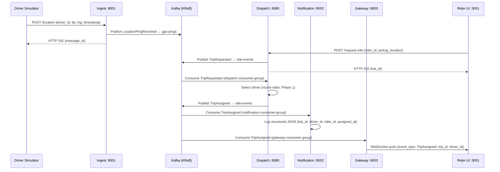

# Real-Time Ride/Delivery Tracking & Dispatch Platform
<details>
  <summary><b>▶️ Click here to watch the YouTube Video Summary</b></summary>
  <br>
  
  <a href="https://youtu.be/gJgjNrIJB3Q">
    
  </a>
</details>

A FAANG-scale, production-grade distributed systems project built to demonstrate real-world backend engineering: high-throughput GPS ingestion, event-driven microservices, real-time WebSocket streaming, and full observability — all running locally in docker-compose and deployable to AWS EKS.

> **Status:** Phase 1 (E2E Skeleton) — complete. The full GPS-ping → Kafka → dispatch → notification pipeline is wired and running. See the [Phase Roadmap](#phase-roadmap) for what's next.

---

## What it does

- Ingests live GPS pings from millions of drivers/couriers at scale
- Matches drivers to nearby riders in real time using an event-driven saga
- Streams live ETAs to customer-facing apps over WebSocket
- Sends push notifications on ride state changes (assigned, cancelled, completed)

---

## Architecture Overview

### End-to-End Data Flow

```
Driver Simulator (Python)
        │
        │  POST /location  {driver_id, lat, lng, timestamp}
        ▼
  Ingest Service (Go :8001)
        │
        │  Avro → Kafka topic: gps-pings
        ▼
  ┌─────────────────────────────────────────────────────────┐
  │              Apache Kafka (3-broker KRaft)              │
  │   Topics: gps-pings · ride-events · notifications       │
  └──────────┬──────────────────────────┬───────────────────┘
             │                          │
             │ TripRequested            │ LocationPingReceived
             │ TripAssigned             │ (CQRS read model)
             ▼                          ▼
  Dispatch Service (Java/Spring :8080)◄──┘
        │  owns Trip aggregate
        │  PostgreSQL via PgBouncer
        │
        │  TripAssigned → ride-events
        ▼
  ┌─────────────────────────────────────────────────────────┐
  │              Apache Kafka (ride-events)                 │
  └──────────┬──────────────────────────┬───────────────────┘
             │                          │
             ▼                          ▼
  Notification Service (Go :8002)   Gateway Service (Go :8003)
  logs structured JSON to stdout    WebSocket push → Rider UI
```

### Sequence: Ride Request → Driver Assigned → Notification



---

## Tech Stack

| Layer | Technology | Why |
|---|---|---|
| **Ingest Service** | Go 1.22 | True goroutine concurrency, sub-ms HTTP latency, handles 10k+ concurrent GPS pings per instance |
| **Dispatch Service** | Java 21 / Spring Boot 3.x | Virtual threads (Project Loom), JPA/JDBC ecosystem, owns the stateful Trip aggregate |
| **Notification Service** | Go 1.22 | Fire-and-forget Kafka consumer, no state, no DB |
| **Gateway Service** | Go 1.22 | Manages 100k+ long-lived WebSocket connections per instance |
| **Message Bus** | Apache Kafka 3.7 (KRaft, 3-broker) | No ZooKeeper, `replication.factor=3`, `min.insync.replicas=2` |
| **Schema Registry** | Confluent Schema Registry | Avro schema enforcement — broker rejects malformed messages |
| **Database** | PostgreSQL 16 via PgBouncer | Trip aggregate, Flyway migrations, transaction pooling |
| **Cache / Geo** | Redis 7.2 | Geospatial driver index (Phase 2), ETA cache, WebSocket session registry |
| **Observability** | OpenTelemetry → Jaeger + Prometheus + Grafana | Traces, metrics, and logs from Phase 1 — not retrofitted |
| **Rider UI** | React 18 + TypeScript + Leaflet | Map-based ride request UI |
| **Driver Simulator** | Python 3.11 | Replays GeoJSON routes at configurable ping rate |

---

## Project Structure

```
realtime-tracking-dispatch/
├── services/
│   ├── ingest/              # Go — GPS ping ingestion (POST /location :8001)
│   ├── dispatch/            # Java 21 — Trip aggregate, ride matching (POST /request-ride :8080)
│   ├── notification/        # Go — TripAssigned consumer, structured JSON logging (:8002)
│   ├── gateway/             # Go — WebSocket hub, Kafka→WS bridge (:8003)
│   ├── tracking/            # Go — (Phase 2) ETA computation, Redis geospatial state
│   └── rider-ui/            # React 18 TypeScript — map UI, ride request button (:3001)
├── shared/
│   ├── avro/                # Avro schemas for all Domain Events (Schema Registry)
│   └── envelope/            # Kafka envelope types (Go + Java)
├── infra/
│   ├── docker/              # Prometheus config, Grafana datasources
│   ├── k8s/                 # Kubernetes manifests (Phase 3)
│   ├── kafka/               # Topic creation script, SASL JAAS config, ACL definitions
│   └── terraform/           # AWS EKS infrastructure (Phase 3)
├── scripts/
│   ├── simulate_driver.py   # Driver GPS ping simulator
│   ├── sample_route.geojson # Sample GeoJSON route (≥10 coordinate pairs)
│   ├── smoke_test.sh        # End-to-end pipeline validation
│   └── throughput_test.sh   # Sustained 10 pings/sec, zero 5xx assertion
├── docs/
│   ├── adr/                 # Architecture Decision Records (7 ADRs)
│   └── query-plans/         # EXPLAIN ANALYZE output for all PostgreSQL queries
├── docker-compose.yml       # Full local stack (single docker-compose up)
├── .env.example             # All required env vars with inline comments
├── Makefile                 # build · test · lint · up · down · check-openapi
└── Requirements.md
```

---

## Bounded Contexts & Domain Events

Each service is a DDD bounded context. Domain objects (`Trip`, `DriverLocation`, `Notification`) are never shared across boundaries — only infrastructure types live in `shared/`. See [ADR 001](docs/adr/001-microservices-with-ddd-bounded-contexts.md).

| Event | Producer | Consumer(s) | Topic |
|---|---|---|---|
| `LocationPingReceived` | Ingest | Tracking (geo state), Dispatch (CQRS read model) | `gps-pings` |
| `TripRequested` | Dispatch | Dispatch (self, async) | `ride-events` |
| `TripAssigned` | Dispatch | Notification, Gateway | `ride-events` |
| `TripCancelled` | Dispatch | Notification, Gateway, Tracking | `ride-events` |
| `TripExpired` | Dispatch | Notification, Gateway | `ride-events` |
| `TripCompleted` | Dispatch | Notification, Gateway | `ride-events` |
| `ETAUpdated` | Tracking | Gateway | `ride-events` |
| `NotificationDispatched` | Notification | — (audit trail) | `notifications` |

All messages use Avro serialisation with Schema Registry. The `event_type` field in the envelope distinguishes events on the same topic.

---

## Getting Started

### Prerequisites

You only need **Docker Desktop** to run the full stack. Everything else (Go compiler, Maven, gcc) runs inside Docker during the build.

| Tool | Purpose | Required? |
|---|---|---|
| [Docker Desktop](https://www.docker.com/products/docker-desktop/) | Runs the entire stack | ✅ Yes |
| Python 3.11+ + `pip install requests` | Driver Simulator | For e2e demo |
| Git Bash | Smoke test script (bash) | For smoke test |
| `jq` | JSON parsing in smoke test | Optional (has fallback) |

Java is already installed on this machine and is useful for running Dispatch service tests locally, but not required for `docker-compose up`.

### 1. Configure environment

```bash
cp .env.example .env
```

Open `.env` and replace every `changeme` with a real password. For local dev these can be anything — just keep them consistent. Example:

```dotenv
POSTGRES_PASSWORD=localdev123
KAFKA_INGEST_PASSWORD=localdev123
KAFKA_DISPATCH_PASSWORD=localdev123
KAFKA_NOTIFICATION_PASSWORD=localdev123
KAFKA_TRACKING_PASSWORD=localdev123
KAFKA_GATEWAY_PASSWORD=localdev123
KAFKA_ADMIN_PASSWORD=localdev123
REDIS_PASSWORD=localdev123
GRAFANA_ADMIN_PASSWORD=admin
```

Leave all hostnames (`kafka-1:9092`, `pgbouncer:5432`, etc.) unchanged — they are Docker internal DNS names.

### 2. Start the full stack

```bash
docker compose up -d
```

This builds all services from source and starts:
- 3-broker Kafka KRaft cluster + Schema Registry
- PostgreSQL + PgBouncer (transaction pooling)
- Redis (password-protected)
- DynamoDB Local (Phase 2 dedup — modelled now)
- Ingest, Dispatch, Notification, Gateway services
- Rider UI (nginx)
- Jaeger, Prometheus, Grafana

**First run:** 5–10 minutes (image pulls + Maven dependency download). Subsequent runs are fast (cached layers).

Watch startup:
```bash
docker compose logs -f
```

Check health:
```bash
docker compose ps
```

### 3. Verify the pipeline

Check service health:
```bash
curl http://localhost:8001/health   # Ingest
curl http://localhost:8080/health   # Dispatch
curl http://localhost:8002/health   # Notification
curl http://localhost:8003/health   # Gateway
```

Submit a ride request:
```bash
curl -X POST http://localhost:8080/request-ride \
  -H "Content-Type: application/json" \
  -d '{"rider_id":"rider-001","pickup_location":{"latitude":37.7749,"longitude":-122.4194}}'
# → HTTP 202 {"trip_id": "<uuid>"}
```

Run the Driver Simulator (in a separate terminal):
```bash
python scripts/simulate_driver.py \
  --driver-id driver-001 \
  --route-file scripts/sample_route.geojson \
  --rate 10 \
  --ingest-url http://localhost:8001
```

### 4. Run the smoke test

Validates the full GPS-ping → Kafka → dispatch → notification pipeline end-to-end:

```bash
bash scripts/smoke_test.sh
```

The script:
1. Runs the Driver Simulator for 5 seconds at 10 pings/sec
2. Submits one ride request and captures the `trip_id`
3. Polls `docker logs notification-service` for a `TripAssigned` log line matching the `trip_id`
4. Exits 0 on success; exits 1 with per-stage diagnostics on timeout

Run the throughput test (asserts zero HTTP 5xx at 10 pings/sec):
```bash
bash scripts/throughput_test.sh
```

### 5. Tear down

```bash
docker compose down       # stop containers, keep data volumes
docker compose down -v    # stop containers and delete all data (clean slate)
```

---

## Observability

| Tool | URL | Credentials |
|---|---|---|
| **Jaeger** — distributed traces | http://localhost:16686 | none |
| **Prometheus** — metrics | http://localhost:9090 | none |
| **Grafana** — dashboards | http://localhost:3000 | admin / your `.env` value |
| **Schema Registry** — registered schemas | http://localhost:8081/subjects | none |
| **Rider UI** | http://localhost:3001 | none |

Every service exports:
- **Traces** via OTLP to Jaeger — `trace_id` propagated through Kafka message headers so a single GPS ping is traceable end-to-end across all hops
- **Metrics** via Prometheus `/metrics` endpoint — HTTP latency (p50/p95/p99), Kafka consumer lag, DB query duration, WebSocket connection count
- **Structured JSON logs** with `trace_id` field — correlates logs to traces in Grafana

---

## API Reference

OpenAPI specs are committed to the repo and served live:

| Service | Committed Spec | Live Endpoint |
|---|---|---|
| Ingest | `services/ingest/openapi.json` | `http://localhost:8001/docs` |
| Dispatch | `services/dispatch/openapi.json` | `http://localhost:8080/v3/api-docs` |
| Notification | `services/notification/openapi.json` | `http://localhost:8002/docs` |

**`POST /location`** (Ingest Service)
```json
{ "driver_id": "driver-001", "latitude": 37.7749, "longitude": -122.4194, "timestamp": "2024-01-15T10:30:00Z" }
```
→ `HTTP 202 { "message_id": "<uuid>" }`

**`POST /request-ride`** (Dispatch Service)
```json
{ "rider_id": "rider-001", "pickup_location": { "latitude": 37.7749, "longitude": -122.4194 } }
```
→ `HTTP 202 { "trip_id": "<uuid>" }`

---

## Security Model

Security is baked in from Phase 1 — not retrofitted. See [ADR 004](docs/adr/004-security-model.md) for the full threat model.

**Phase 1 (implemented):**
- No secrets in source control — all credentials via `.env` (gitignored); `.env.example` committed
- Per-service Kafka SASL/PLAIN credentials with topic-level ACLs — each service can only access the topics it owns
- Docker named network segmentation — `kafka-net`, `db-net`, `frontend-net`, `observability-net`
- Non-root users in all Dockerfiles; pinned base image versions (no `latest`)
- 64 KB request body cap on all HTTP endpoints
- Services fail fast with a descriptive error if any required environment variable is missing

**Phase 2 (planned):**
- SASL/SCRAM-SHA-512 over TLS (SASL_SSL) replacing SASL/PLAIN
- JWT authentication at the Gateway with driver/rider identity binding
- Rate limiting (20 pings/sec per driver, 5 ride requests/min per rider)
- HashiCorp Vault for dynamic secret rotation

---

## Architecture Decision Records

| ADR | Decision |
|---|---|
| [ADR 001](docs/adr/001-microservices-with-ddd-bounded-contexts.md) | Microservices with DDD bounded contexts |
| [ADR 002](docs/adr/002-eventual-consistency-and-outbox-pattern.md) | Eventual consistency and the Outbox Pattern |
| [ADR 003](docs/adr/003-idempotency-strategy.md) | Idempotency strategy (DynamoDB dedup table) |
| [ADR 004](docs/adr/004-security-model.md) | Security model and Kafka auth phase progression |
| [ADR 005](docs/adr/005-cqrs-local-read-model-for-dispatch.md) | CQRS local read model for Dispatch (no sync calls to Tracking) |
| [ADR 006](docs/adr/006-saga-pattern-choreography-to-orchestration.md) | Saga pattern: choreography (Phase 1/2) → orchestration (Phase 3+) |
| [ADR 007](docs/adr/007-demo-infrastructure-cost-strategy.md) | Demo infrastructure cost strategy (~$0.30–0.80 per 4-hour session) |

---

## Phase Roadmap

| Phase | Goal | Status |
|---|---|---|
| **Phase 1 — E2E Skeleton** | Full GPS-ping → Kafka → dispatch → notification pipeline in docker-compose. Trip state machine (REQUESTED → ASSIGNED → CANCELLED). Avro schemas + Schema Registry. OpenTelemetry from day one. Smoke test + throughput test. | ✅ Complete |
| **Phase 2 — Tracking & ETAs** | Real geospatial matching via Redis GEOADD CQRS read model. Live ETA streaming over WebSocket. Formal choreography saga with `TripCancelled`/`TripExpired` compensating events. Outbox Pattern for atomic DB + Kafka writes. DynamoDB idempotency table for Notification Service. SASL/SCRAM-SHA-512 over TLS. | ⬜ Planned |
| **Phase 3 — Full Lifecycle + Kubernetes** | Driver acceptance flow. Payment processing. Saga Orchestrator (process manager) in Dispatch. Deploy to AWS EKS with Strimzi Kafka Operator, self-hosted Redis StatefulSet, Aurora Serverless v2. KEDA autoscaling on Kafka consumer lag. mTLS via cert-manager + Vault PKI. | ⬜ Planned |
| **Phase 4 — Scale & Reliability** | Flink stream processing for complex event patterns. Debezium CDC for audit log. Kinesis Firehose → S3 → Athena for GPS history queries. Chaos engineering. SLO dashboards. | ⬜ Planned |

---

## Key Architectural Constraints

- GPS pings always go through Kafka — never written directly to the database from the ingest endpoint
- Driver location state lives in Redis; PostgreSQL is the source of truth for Trip records
- Services communicate asynchronously via Kafka Domain Events — no synchronous cross-context calls in the hot path
- The Dispatch service maintains a local CQRS read model of driver locations by consuming `LocationPingReceived` — it never calls Tracking synchronously ([ADR 005](docs/adr/005-cqrs-local-read-model-for-dispatch.md))
- The Gateway is a Kafka consumer like any other — it translates Kafka events to WebSocket frames; it does not fan out events
- Each service owns its own database schema — no cross-service direct DB access
- `shared/` contains only infrastructure types (Avro schemas, Kafka envelope, health DTOs) — never domain objects
- All Kafka producers use `acks=all`, `enable.idempotence=true`
- W3C `traceparent` headers are injected by producers and extracted by consumers — every hop is a span in the same trace
